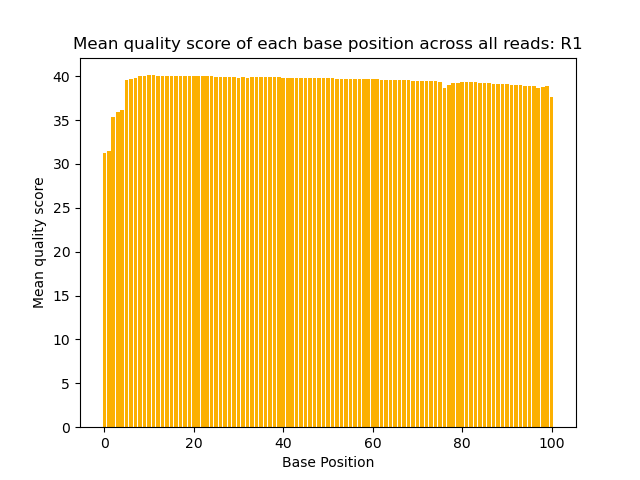
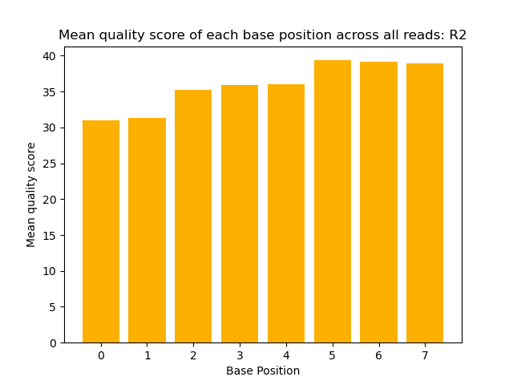
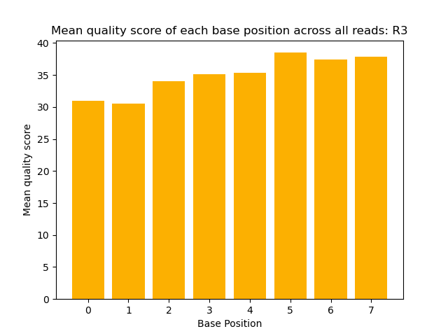
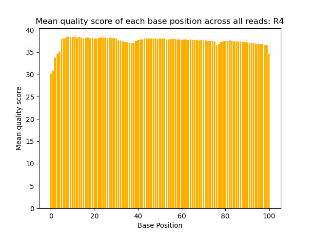

# Assignment the First

## Part 1
1. Be sure to upload your Python script. Provide a link to it here: https://github.com/lenarayneallen/Demultiplex/blob/master/Assignment-the-first/qs_dist.py

| File name | label | Read length | Phred encoding |
|---|---|---|---|
| 1294_S1_L008_R1_001.fastq.gz |R1 - Biological|101|33|
| 1294_S1_L008_R2_001.fastq.gz |R2 - Index|8|33|
| 1294_S1_L008_R3_001.fastq.gz |R3 - Index|8|33|
| 1294_S1_L008_R4_001.fastq.gz |R4 - Biological|101|33|

2. Per-base NT distribution
    1. Use markdown to insert your 4 histograms here.
    
    
    
    

    2.  
        Biological reads do not typically need to be a perfectly identical match to align to a genome. Thus, the consequences of a few individual errors within a biological read are not particularly severe, and the quality score cutoff does not need to be as stringent as the quality score cutoff for index reads. Based on the plot of mean quality scores per base position of all biological reads, it seems that there are no base positions for which the mean quality score is less than 30. Therefore, I would propose that a mean quality score cutoff of 30 be used for biological reads. This cutoff will allow for reads with only handful of bases with very low quality scores to still be used in downstream analysis. 


        An errorneous base in an index read is more problematic in this scenario as the reads are only 8 base pairs long. If an index is misinterpreted as a different index used in the same lane, it could lead to sample identification errors. Therefore, I would propose a base-by-base quality score cutoff of 30 (which indicates a 1:1000 error rate) for the indexes. This would mean that the entire index read is filtered out if it contains a single base with a quality score less than 30. 


    3. `zcat 1294_S1_L008_R2_001.fastq.gz | awk 'NR % 4 == 2' | grep -c -E ".*N.*"`
   
         Number of R2 Indexes with undetermined base calls: `3976613`

        `zcat 1294_S1_L008_R3_001.fastq.gz | awk 'NR % 4 == 2' | grep -c -E ".*N.*"`

        Number of R3 Indexes with undetermined base calls: `3328051`

## Part 2
1. Define the problem

    The ultimate goal is to demultiplex the R1, R2, R3, and R4 fastq files. Given a table containing all 24 barcodes used in this sequencing experiment, the algorithm should iterate through each barcode. For each barcode, the algorithm should then sort through all four files record-by-record to find instances where the indexes (sequences in R2 and R3) match both each other and the current barcode. If there is a match that satisfies these conditions, the according records from R1 and R4 should each be written to a different file containing the current barcode and R1 (for R1) or R2 (for R4). When writing these records, the two barcodes themselves should be appended to the header of each record. 

    If the index sequences 1) contain any Ns in their quality scores, 2) are not in the list of 24 barcodes, or 3) have quality scores whose average is below a given threshold, the agorithm should write them to files whose titles contain "unknown" and and R1/R2. If the indexes otherwise do not match, this indicates potential index hopping, and the algorithm should write them to the files whose titles contain "hopped" and R1/R2. 

2. Describe output

    For this particular sequencing experiment, you would want the demultiplexing process to ultimately produce 52 files:

    - 48 files with matched records (2 for each of the 24 indexes)
    - 2 files for records of index hopped reads
    - 2 files for records of unknown reads

3. Upload your [4 input FASTQ files](../TEST-input_FASTQ) and your [>=6 expected output FASTQ files](../TEST-output_FASTQ).
4. Pseudocode
5. High level functions. For each function, be sure to include:
    1. Description/doc string
    2. Function headers (name and parameters)
    3. Test examples for individual functions
    4. Return statement

```
def ReverseComplement(seq: str) -> str:
	```Takes a sequence and returns the reverse complement of that sequence```
	return reverse_complement_of_seq
	Input: ACTG
	Expected output: CAGT
```
```
def QS_Thresh(qual_score_string: str, cutoff: int) -> bool:
	```Given a string of quality scores and a cutoff value, returns True if no scores are below the cutoff and False if one or more scores are below the cutoff```
    return True or False
	Input: #AAA9JJF, 30
    Expected Output: False
```
```
def Append_indexes(header: str, index1: str, index2: str) -> str
    ```Provided a header line (as a string) and two index sequences 
    (also as strings) append index sequences to header line in the following
    format: header index1-index2
    return updated_header
    Input: @K00337:83:HJKJNBBXX:8:1101:1286:1191 4:N:0:1, TACGCTAC, GTAGCGTA
    Expected Output: @K00337:83:HJKJNBBXX:8:1101:1286:1191 TACGCTAC-GTAGCGTA
```